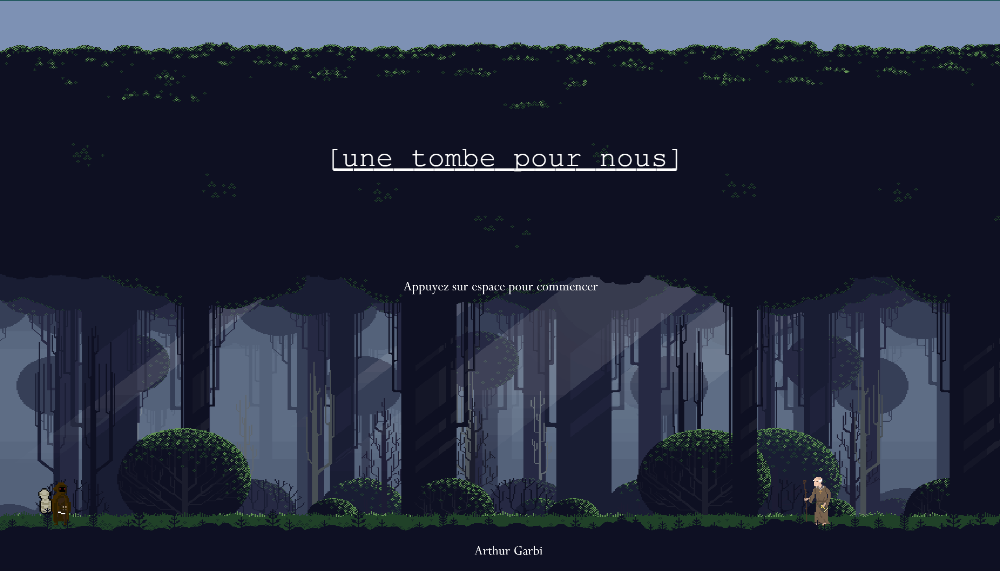

# une-tombe-pour-nous

## Description
Dans ce cours jeu 2D, vous contrôlez un personnage étrange chargé d'un cadavre cherchant une terre saine pour l'inhumer. Vos pérégrinations vous feront passer par des lieux aussi inhospitaliers que mystérieux où le danger guette à tout instant. Le jeu est également accompagné de diverses musiques habillant les différentes séquences. Il s'agit de l'adaptation en 2D de la fiction interactive, autrement plus longue et complète, "Des lits pour eux" : https://github.com/GutereuxMarde/Des-lits-pour-eux---FI

## Installation
Pour jouer au jeu, il vous suffira d'installer le fichier du jeu (une tombe pour nous.zip) et d'en extraire le dossier, avant de l'ouvrir via Visual Studio Code.

## Supplément
Associé au fichier du jeu, vous trouverez un fichier contenant les différentes pistes audio ainsi que les différents sprites.

## Sources
Voici la liste des musiques utilisées :

Healing Forest - Light Music   https://pixabay.com/music/meditationspiritual-healing-forest-187590/

Garden of Eden - Light Music   https://pixabay.com/music/meditationspiritual-garden-of-eden-186428/

Midnight Forest - Syouki Takahashi   https://pixabay.com/music/ambient-midnight-forest-184304/

Mystery Horror - UNIVERSFIELD   https://pixabay.com/music/mystery-mystery-horror-192898/

Dark Horror Ambient - Dark Room - Keyframe Audio   https://pixabay.com/music/mystery-dark-horror-ambient-dark-room-133815/

Cosmic Horror Theme - SamuelFrancisJohnson   https://pixabay.com/music/mystery-cosmic-horror-theme-140473/

Forest Keeper - HarumachiMusic  https://pixabay.com/music/solo-piano-forest-keeper-165121/

Voici la liste des sprites utilisés ou modifiés : 

Mystery Monk - Merry Dream Games   https://opengameart.org/content/mystery-monk

Death - Merry Dream Games  https://opengameart.org/content/death

Little Mummy - PiXeRaT  https://opengameart.org/content/little-mummy

Old Man - Thalmus  https://opengameart.org/content/old-man

Free pixel art forest - edermunizz  https://edermunizz.itch.io/free-pixel-art-forest

Free-Hero's Journey-Moon Graveyard - Anokolisa  https://anokolisa.itch.io/moon-graveyard

stringstar fields - Trixie  https://trixelized.itch.io/starstring-fields

Dark Dungeon - Side-Scroller Tileset - Raou  https://raou.itch.io/dark-dun

Critters - Lazy River Tileset - Foozle  https://foozlecc.itch.io/critters-lazy-river

Free 48x48 Pixel Art trees + 16x32 trees - Graph Script Dev  https://graphscriptdev.itch.io/plant-trees

Free fish assets - AGD-Awkward Game Dev  https://agdawkwardgamedev.itch.io/free-fish-assets

## Contexte de développement
Ce jeu a été réalisé par Arthur Garbi sur Kaboom.js dans le cadre du cours Développement de jeux vidéo 2D dispensé par Isaac Pante (SLI, Lettres, UNIL) à l'Université de Lausanne.
